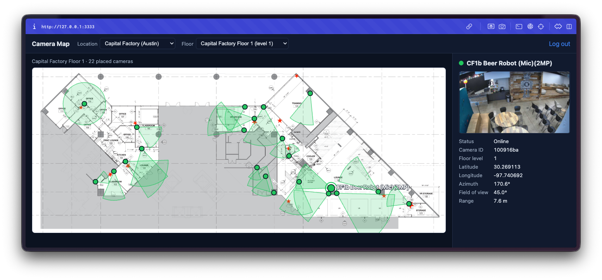

# Camera Map — Plotting Cameras on a Floor Plan

A reference sample for the **Eagle Eye Networks (Brivo Video) API v3** that logs in,
fetches a building's floor plan and its cameras, and draws each camera at its real
position on the plan — oriented to the direction it faces and colored by status.



The interesting part isn't the UI — it's getting the **camera positions to land in the
right place on the plan image**. The API gives you each camera's geographic position
(`latitude`/`longitude`) and the floor's two corner coordinates, but mapping one onto
the other correctly is not obvious. The naïve approach (stretch longitude across the
image width and latitude across the height) puts cameras in the wrong spots and pushes
some off the plan entirely. This sample shows the **correct projection** and matches the
placement you see in the EEN VMS.

---

## What this sample demonstrates

- **OAuth 2.0** authorization-code login against Eagle Eye Networks.
- Fetching **locations**, **floors** (with corner coordinates), and the **floor-plan image**.
- Fetching **cameras** with `devicePosition` (latitude, longitude, azimuth, floor, range, FOV) and connection status.
- The **geo → pixel projection** (a *similarity transform*) that places cameras exactly where the VMS does.
- Drawing **field-of-view cones**, **status colors**, and a clickable detail panel.
- Working around browser **CORS** with a small dev proxy.

---

## Two ways to explore

### 1. Standalone projection demo — no build required

Open **[`example/floor-plan-projection-sample.html`](example/floor-plan-projection-sample.html)**
directly in a browser. It needs no server, no credentials, and no dependencies, and loads the
bundled real floor plan ([`example/floor-plan.png`](example/floor-plan.png)) automatically. It
renders the same set of cameras two ways, side by side:

- ❌ **Naïve bilinear** (longitude→x, latitude→y) — the common mistake; cameras spill off the plan.
- ✅ **Similarity transform** — the correct method; cameras land where the VMS draws them.

This is the quickest way to understand the core idea. The transform is implemented and commented
inline in that single file.

> If your browser blocks the local image over `file://`, use the file picker in the page to select
> `example/floor-plan.png`, or serve the folder (e.g. `npx serve example`).

### 2. The full app — OAuth + live data (Vite)

A small React + TypeScript app that performs the real login and renders your account's floors
and cameras.

```bash
npm install
cp .env.example .env.local      # fill in your credentials (see Configuration)
npm run dev                     # http://127.0.0.1:3333
```

You can also click **“Explore demo data”** on the login screen (or set `VITE_USE_FIXTURES=true`)
to render bundled sample data with no login at all.

---

## Prerequisites

- Node.js 18+.
- An Eagle Eye Networks application (`client_id` + `client_secret`) from the
  [EEN Developer Portal](https://developer.eagleeyenetworks.com/).
- The redirect URI **`http://127.0.0.1:3333/callback`** registered on your app, **exactly**
  (string-exact — `127.0.0.1` is not `localhost`).
- Location-based features (floors / floor plans) require a **professional or enterprise** edition account.

---

## Configuration

Copy `.env.example` to `.env.local` and fill in:

```
VITE_EEN_CLIENT_ID=your_client_id
VITE_EEN_CLIENT_SECRET=your_client_secret
VITE_EEN_REDIRECT_URI=http://127.0.0.1:3333/callback
# Optional: set true to skip auth and use bundled sample data
VITE_USE_FIXTURES=false
```

> `.env.local` is git-ignored. See [Production considerations](#production-considerations) about
> the client secret.

---

## How it works

After login, the app runs this sequence (see [`src/MapView.tsx`](src/MapView.tsx)):

| Step | Request | Purpose |
|---|---|---|
| 1 | `GET /locations` | List locations; you pick one. |
| 2 | `GET /locations/{id}/floors?include=floorPlans` | Floors with corner coordinates + plan references. |
| 3 | `GET /locations/{id}/floors/{floorId}.{type}` | The plan image (binary). **Send `Accept: */*`.** |
| 4 | `GET /cameras?include=devicePosition,status&locationId__in={id}` | Camera positions + status. |
| 5 | — | Keep cameras where `devicePosition.floor === floor.floorLevel` and lat/lng are non-null. |
| 6 | — | Project each lat/lng → plan pixel and draw. |

All API calls go to the per-account base URL (`https://{httpsBaseUrl}/api/v3.0/...`) returned at
login, with `Authorization: Bearer {access_token}`.

---

## The projection (the important bit)

A floor plan is georeferenced by **two opposite corner coordinates** — `topLeftCoordinates`
maps to image pixel `(0, 0)` and `bottomRightCoordinates` maps to pixel `(W, H)` — **plus the
image's pixel dimensions** `W`×`H`. The plan is a uniformly-scaled, rotated drawing of the floor,
so the correct mapping is a **similarity transform** (uniform scale + rotation + a reflection,
because image pixels are y-down while geographic north is up).

```ts
const M_PER_DEG_LAT = 111320

function planTransform(floor, W, H) {
  const tl = floor.topLeftCoordinates, br = floor.bottomRightCoordinates
  const midLat = ((tl.latitude + br.latitude) / 2) * Math.PI / 180
  const mPerLat = M_PER_DEG_LAT
  const mPerLng = M_PER_DEG_LAT * Math.cos(midLat)
  const Ebr = (br.longitude - tl.longitude) * mPerLng   // bottomRight in meters
  const Nbr = (br.latitude  - tl.latitude)  * mPerLat   // relative to topLeft
  const den = W * W + H * H
  const a = (W * Ebr - H * Nbr) / den                   // reflection-similarity
  const b = (H * Ebr + W * Nbr) / den                   // coefficients
  const s2 = a * a + b * b
  return { a, b, s2, tl, mPerLat, mPerLng, pxPerMeter: 1 / Math.sqrt(s2) }
}

function projectToPixel(t, lat, lng) {
  const E = (lng - t.tl.longitude) * t.mPerLng
  const N = (lat - t.tl.latitude)  * t.mPerLat
  return { x: (t.a * E + t.b * N) / t.s2, y: (t.b * E - t.a * N) / t.s2 }
}
```

> **Why not just interpolate longitude→x and latitude→y?** Because the floor's geographic
> bounding box and the image rarely share an aspect ratio (a real floor's box can be portrait
> while the plan image is landscape). A per-axis stretch smears cameras across the wrong axis.
> The similarity transform uses the image dimensions to recover the correct scale and rotation.

The same transform, applied to a unit vector along the camera's `azimuth`, gives the correct
on-screen facing direction for the field-of-view cones.

The implementation lives in [`src/map/geo.ts`](src/map/geo.ts) (`planTransform`, `projectToPixel`,
and the FOV cone), and the same transform is reproduced standalone in
[`example/floor-plan-projection-sample.html`](example/floor-plan-projection-sample.html).

---

## Project structure

```
example/
  floor-plan-projection-sample.html # standalone, no-build demo (incorrect vs correct)
  floor-plan.png                    # sample floor plan used by the demo
index.html, vite.config.ts          # Vite app entry + dev proxy
public/floor-plan.png               # bundled plan shown in "Explore demo data" mode
src/
  App.tsx                           # login / callback / map routing
  MapView.tsx                       # data loading + layout
  auth/oauth.ts                     # OAuth flow + token storage
  api/
    client.ts                       # fetch wrapper (Bearer, 401-refresh, pagination)
    locations.ts                    # locations, floors, floor-plan image
    cameras.ts                      # cameras + devicePosition
    feeds.ts                        # optional live preview
    fixtures.ts                     # bundled sample data (demo mode)
  map/
    geo.ts                          # the projection transform + FOV cones
    FloorStage.tsx                  # plan image + SVG overlay
    CameraMarker.tsx                # marker + cone
  ui/                               # detail panel, location/floor picker
```

---

## Notes & gotchas

- **The plan image's pixel dimensions are required** for the projection, and they are **not**
  in the floor or plan metadata — read them from the fetched image (`naturalWidth`/`naturalHeight`).
- **Fetch the plan image with `Accept: */*`.** A specific `Accept: image/png` returns `406`.
  The image is auth-protected, so fetch it with the Bearer header and use a blob/object URL.
- **Match cameras to a floor by `floorLevel`**, comparing `devicePosition.floor` to `floor.floorLevel`
  (not the floor `id`).
- **Some valid positions fall slightly outside the plan** — handle gracefully (render with overflow
  or clamp).
- **CORS:** neither the auth host nor the per-account API host sends permissive CORS headers, so the
  Vite dev server proxies both (see [`vite.config.ts`](vite.config.ts)). The API host is
  account-specific, so the proxy targets it dynamically from an `x-een-host` header.

---

## Production considerations

This is a local development sample. Before deploying anything real:

- **Never ship the `client_secret` to the browser.** Perform the OAuth token exchange on a server
  (or serverless function) and keep the secret there.
- Replace the Vite dev proxy with a proper server-side proxy/backend for the auth and API hosts.
- Store tokens securely (this sample uses `localStorage` for simplicity).

---

## Further reading

- [Eagle Eye Networks Developer Portal](https://developer.eagleeyenetworks.com/)
- [`src/map/geo.ts`](src/map/geo.ts) — the projection transform and FOV-cone implementation, with comments.
